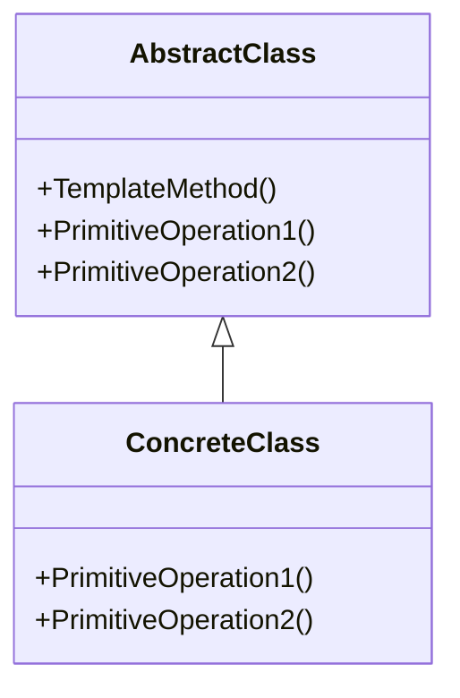
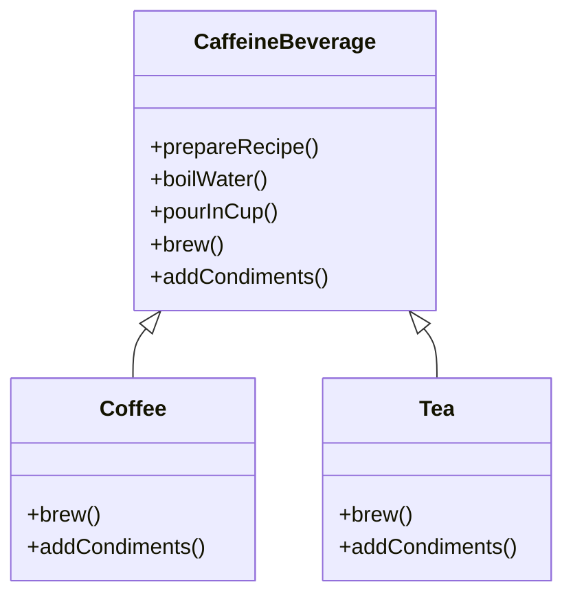

```mermaid
classDiagram

class AbstractClass {
    +TemplateMethod()
    +PrimitiveOperation1()
    +PrimitiveOperation2()
}

class ConcreteClass {
    +PrimitiveOperation1()
    +PrimitiveOperation2()
}

AbstractClass <|-- ConcreteClass
```

```mermaid
classDiagram

class CaffeineBeverage {
    +prepareRecipe()
    +boilWater()
    +pourInCup()
    +brew()
    +addCondiments()
}

class Coffee {
    +brew()
    +addCondiments()
}

class Tea {
    +brew()
    +addCondiments()
}

CaffeineBeverage <|-- Coffee
CaffeineBeverage <|-- Tea
```