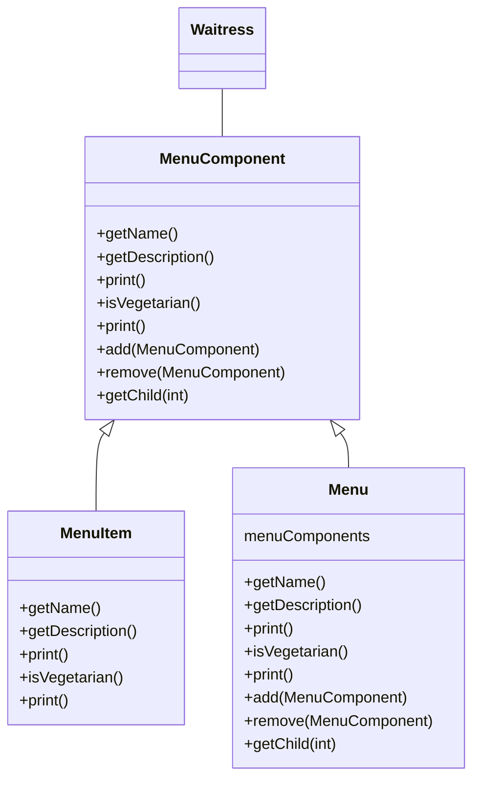

```mermaid
classDiagram

class Waitress 

class MenuComponent {
    +getName()
    +getDescription()
    +print()
    +isVegetarian()
    +print()
    +add(MenuComponent)
    +remove(MenuComponent)
    +getChild(int)
}

class MenuItem {
    +getName()
    +getDescription()
    +print()
    +isVegetarian()
    +print()
}

class Menu {
    menuComponents
    +getName()
    +getDescription()
    +print()
    +isVegetarian()
    +print()
    +add(MenuComponent)
    +remove(MenuComponent)
    +getChild(int)
}

Waitress -- MenuComponent
MenuComponent <|-- MenuItem
MenuComponent <|-- Menu


```