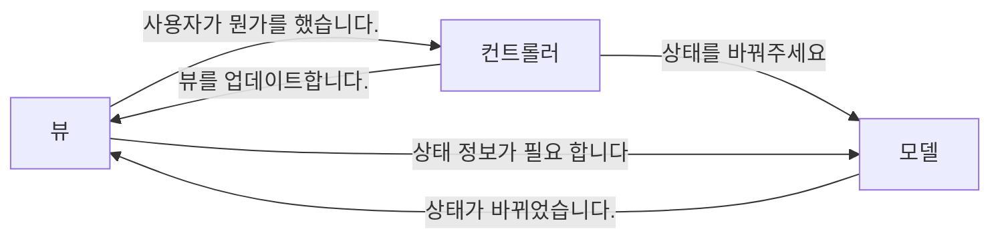

```mermaid
flowchart LR
   뷰 -- 사용자가 뭔가를 했습니다. --> 컨트롤러
    컨트롤러 -- 뷰를 업데이트합니다. --> 뷰
    컨트롤러 -- 상태를 바꿔주세요 --> 모델
    모델 -- 상태가 바뀌었습니다. --> 뷰
    뷰 -- 상태 정보가 필요 합니다 --> 모델

```

## 전략패턴

뷰와 컨트롤러는 고전적인 전략 패턴으로 구현되어 있습니다. 뷰 객체를 여러 전략을 써서 설정이 가능함
컨트롤러는 전략을 제공

```mermaid
flowchart LR
   뷰 -- 사용자가 뭔가를 했습니다. --> 컨트롤러
    컨트롤러 -- 뷰를 업데이트합니다. --> 뷰
    컨트롤러 -- 상태를 바꿔주세요 --> 모델
    모델 -- 상태가 바뀌었습니다. --> 뷰
    뷰 -- 상태 정보가 필요 합니다 --> 모델

```