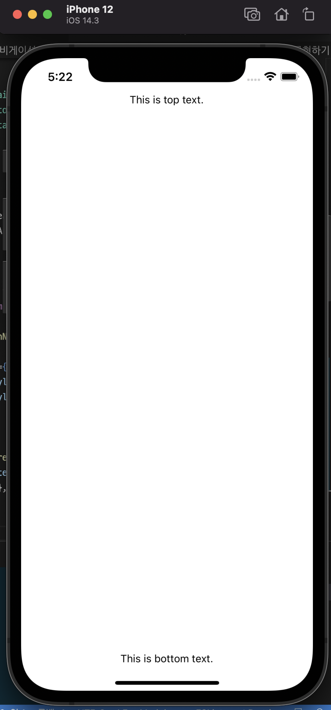
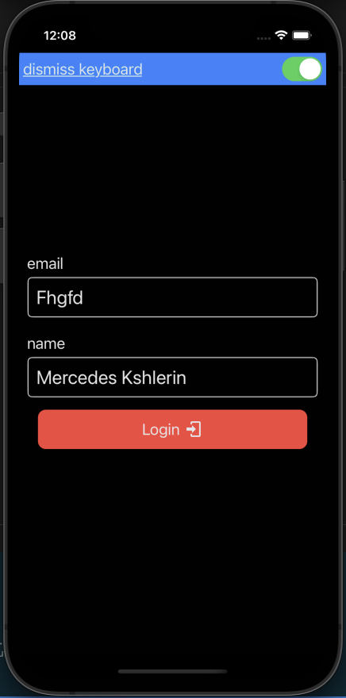
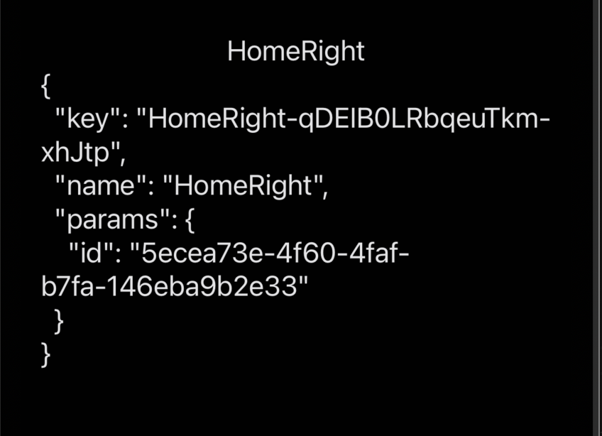

# 리액트 내비게이션

- 모바일 앱이 동작하는 `스마트폰은 화면 크기가 작기` 때문에
- ┣ 여러 개의 작은 `화면으로 분할해 앱을 구현`해야 함
- ┣ 이 장에서는 이런 상황에 대처하고자 만든
- ┗ `리액트 내비게이션(@react-navigation)` 버전 5 패키지가 제공하는 기능 학습

## 목차

# 리액트 내비게이션 패키지 이해하기

- 리액트 내비게이션 패키지는 모바일 앱 UI를 구성할 때 반드시 사용해야 하는
- ┗ `중요한 패키지임`

## 리액트 내비게이션 패키지란?

- 모바일 앱은 화면 크기가 작아서 많은 양의 정보를 동시에 보여줄 수 없음
- ┣ 이 때문에 UI는 상당히 많은 분량의 작은 화면으로 분할하고
- ┣ 사용자가 보고자 하는 화면만 보여주게 되는데
- ┗ 이를 `내비게이션(navigation)`

- 화면 내비게이션 기능은 앱 개발자가 스스로 구현하기에는 부담감이 큼
- ┗ 그렇기 때문에 리액트 내비게이션과 같은 오픈소스 라이브러리를 이용하는 것이 일반적

- React Navigation은 내비에게이션 기능이 필요한 앱 개발에서 가장 많이 사용하는 패키지
- ┗ 이 패키지는 독립적 또는 함께 동작이 가능한 다음 3개의 패키지를 모은 것

| 패키지 이름                   | 기능                          |
| ----------------------------- | ----------------------------- |
| @react-navigation/stack       | 스택 내비게이션 기능을 제공   |
| @react-navigation/bottom-tabs | 탭 내비게이션 기능을 제공     |
| @react-navigation/drawer      | 드로어 내비게이션 기능을 제공 |

> 그런데 이들 패키지가 동작 하기 위해서 반드시 함께 설치해야 하는 패키지가 존재

### 리액트 내비게이션 앱 개발 시 필수 설치 패키지

- 리액트 내비게이션 버전 5.x 패키지는 이전 버전과 다르게 다음 패키지를 함께 설치해야 동작

> 설치

    yarn add react-native-gesture-handler react-native-reanimated react-native-screens react-native-safe-area-context
    yarn add @react-native-community/masked-view

> 필수 설치

    yarn add @react-navigation/native

- 참고로 `리액트 내비게이션`은 현재 버전 5x로 버전 5 부터는
- ┗ `@react-navigation/패키지_이름` 형태로 사용

### 리액트 내비게이션 앱 개발 시 선택적으로 설치하는 패키지

- 다음 패키지들은 사용할 때만 설치
- ┣ 보통 `@react-navigation/stack`을 가장 많이 사용하지만
- ┣ 기능을 추가할수록 `bottom-tabs`와 `drawer` 패키지까지 설치하게 됨
- ┗ 여기서는 모두 설치

> stack 설치

    yarn add @react-navigation/stack

> bottom-tabs

    yarn add @react-navigation/bottom-tabs

> drawer

    yarn add @react-navigation/drawer

### 프로젝트 만들기

> native-init

    npx react-native init ch07_Navigation_Init --template react-native-template-typescript

> 필수 패키지 설치

     yarn add react-native-vector-icons react-native-paper color faker moment moment-with-locales-es6 react-native-appearance
     yarn add @types/react-native-vector-icons @types/color @types/faker
     yarn add react-native-keyboard-aware-scroll-view

> 내비게이션 필수 패키지 설치

    yarn add react-native-gesture-handler react-native-reanimated react-native-screens react-native-safe-area-context
    yarn add @react-native-community/masked-view
    yarn add @react-navigation/native
    yarn add @react-navigation/stack @react-navigation/bottom-tabs @react-navigation/drawer

> 아이폰에서 디스플레이 버그가 있는 버전
>
> > MainNavigator 오류만 안나게 설정

```tsx
import React from ' react';
import { StyleSheet, View, Text } from 'react-native';

export default function MainNavigator() {
	return (
		<View style={[styles.view]}>
			<Text>This is top text.</Text>
			<Text>This is bottom text.</Text>
		</View>
	);
}
const styles = StyleSheet.create({
	view: { flex: 1, alignItems: 'center', justifyContent: 'space-between' },
});
```

> App.tsx 오류만 안나게 설정

- 실행 시켜보면 아이폰의 경우 `SafeAreaView`를 사용하지 않으므로
- ┗ 텍스트가 제대로 보이지 않는 오류가 생기게 됨

> 이제 이 상황을 염두에 두면서 시작

### 리액트 내비게이션 관련 package.json의 dependencies 항목

- 다음 package.json 파일 내용은 앞서 소개한 모든 패키지 설치했을 때 버전
- ┗ `@react-navigation` 패키지는 모두 버전 5임을 확인 가능

> 이제 @react-navigation/native 패키지가 제공하는
>
> > NavigationContainer 컴포넌트를 알아보기

### NavigationContainer 컴포넌트

- 모든 리액트 네비게이션 `화면 컴포넌트(src/screens 디렉터리 컴포넌트)`
- ┗ 항상 `NavigationContainer`의 자식 컴포넌트로 동작해야 함

> NavigationContainer 컴포넌트

```tsx
import { NavigationContainer } from '@react-navigation/native';
```

- 그러므로 리액트 내비게이션을 가장 최소한으로 구현하는 `App.tsx`
- ┣ 다음 형태를 가져야함
- ┣ `src/screens` 디렉터리에 생성한 화면 컴포넌트는
- ┗━ `MainNavigator` 의 자식 컴포넌트 형태로 구현하는 것이 보통

> 리액트 내비게이션 기능 최소한으로 구현

```tsx
import React from 'react';
import MainNavigator from './src/screens/MainNavigator';
import { NavigationContainer } from '@react-navigation/native'; // -1-
export default function App() {
	return (
		<NavigationContainer>
			<MainNavigator />
		</NavigationContainer>
	);
}
```

1. NavigatorContainer 를 이용해서 감싸기

### react-native-gesture-handler와 react-native-screens 패키지 사용

- 앞서 `react-native-gesture-handler`, `react-native-screens` 패키지를 설치

- `react-native-gesture-handler` 패키지
- ┣ 네이티브 모듈에서 동작하는 진화된 `PanResponder` 역할을 함
- ┣ R/N 패키지는 `react-native-gesture-handler` 패키지를
- ┗ 다음처럼 임포트해야 한다고 설명

> react-native-gesture-handler 패키지 가져오기

```tsx
import 'react-native-gesture-handler';
```

- 리액트 내비게이션 5.x 패키지는 그 이전의 4.x 패키지와 다르게
- ┣ `상당 부분의 동작`을 `네이티브 모듈 쪽에서 동작`하게 하여
- ┣ `전체 화면 렌더링 속도`를 `향상`시켰음
- ┣ 그리고 이러한 `성능 향상`은 `react-native-screens`
- ┣ 패키지 기능을 `활용`하여야 얻을 수 있음
- ┗ `react-native-screens` 모듈을 동작하게 하려면 다음 코드를 `App.tsx` 구현

> react-native-screens 모듈 동작에 필요한 코드

```tsx
import { enableScreens } from 'react-native-screens';
enableScreen();
```

### react-native-safe-area-context 패키지의 역할

- 앞서 아이폰 화면은 텍스트가 정상적인 위치에 보이지 않았음
- ┣ `@react-navigation` 필수 패키지인
- ┣ `react-native-safe-area-context`는 다음 컴포넌트를 제공
- ┗ 아이폰 화면 문제를 해결 가능!!!

> SafeAreaProvider 컴포넌트

```tsx
import { SafeAreaProvider } from 'react-native-safe-area-context';
```

- `SafeAReaProvider` 는 `Provider` 이기 때문에
- ┗ `MainNavigator` 의 부모 컴포넌트여야 함!

> SafeAreaProvider 컴포넌트는 MainNavigator의 부모 컴포넌트로

```tsx
<SafeAreaProvider>
	<MainNavigator />
</SafeAreaProvider>
```

### 리액트 내비게이션용 App.tsx 컴포넌트 구현하기

- 다음 코드는 언급한 내용을 종합한 최소 구현 리액트 내비게이션용 App.tsx

```tsx
import React from 'react';
import MainNavigator from './src/screens/MainNavigator';
import 'react-native-gesture-handler';
import { enableScreens } from 'react-native-screens';
import { SafeAreaProvider } from 'react-native-safe-area-context';

import { NavigationContainer } from '@react-navigation/native';

enableScreens();

export default function App() {
	return (
		<SafeAreaProvider>
			<NavigationContainer>
				<MainNavigator />
			</NavigationContainer>
		</SafeAreaProvider>
	);
}
```

- 그러나 앞의 코드의 SafeAreaProvider를 사용하더라도
- ┗ 다음 코드에서 보듯 SafeAreaView를 사용해야 아이폰의 안전영역 해결

```tsx
import React from 'react';
import { StyleSheet, Text } from 'react-native';
import { SafeAreaView } from 'react-native-safe-area-context';

export default function MainNavigator() {
	return (
		<SafeAreaView style={[styles.view]}>
			<Text style={styles.text}>This is top text.</Text>
			<Text style={styles.text}>This is bottom text.</Text>
		</SafeAreaView>
	);
}
const styles = StyleSheet.create({
	view: { flex: 1, alignItems: 'center', justifyContent: 'space-between' },
	text: { color: 'black' },
});
```



## 리액트 내비게이션 테마

- 리액트 내비게이션은 theme 속성에 설정할 수 있는
- ┗ DefaultTheme과 DarkTheme 객체를 다음처럼 제공

> DefaultTheme과 DarkTheme 객체

```tsx
import {
	NavigationContainer,
	DefaultTheme,
	DarkTheme,
} from '@react-navigation/native';
```

- 다음은 DarkTheme 객체의 키와 값

> DarkTheme 객체의 키와 값

```tsx
{
    "colors": {
        "background" : "rgb(1,1,1)"
        "border": "rgb(39,39,41)"
        "card": "rgb(18, 18, 18)",
        "primary": "rgb(10,132,255)",
        "text": "rgb(229, 229, 231)",
    },
    "dark": true
}
```

- NavigationContainer는 theme 이란 속성을 제공
- ┗ theme 속성은 다음 코드처럼 DefaultTheme, DarkTheme 제공하는데 사용

> theme 속성 사용

```tsx
import { useColorScheme } from 'react-native-appearance';
import { DefaultTheme, DarkTheme } from '@react-navigation/native';

export default function App() {
	const isDarkTheme = useColorScheme();
	const [theme, setTheme] = useState(isDarkTheme ? DarkTheme : DefaultTheme);
}
```

### ToggleThemeProvider 컴포넌트 적용

- 앞서 `ToggleThemeProvider` 컴포넌트와 `useToggleTheme` 커스텀 훅을 제작한 바 있음
- ┣ 이제 App.tsx 에 다음처럼 `ToggleThemeProvider` 컴포넌트를 적용하면
- ┗ `MainNavigator`의 `Switch` 컴포넌트를 조작하여 앱의 테마 변경 가능

```tsx
import React, { useState, useCallback } from 'react';

import MainNavigator from './src/screens/MainNavigator';
import {
	NavigationContainer,
	DefaultTheme,
	DarkTheme,
} from '@react-navigation/native';
import { AppearanceProvider, useColorScheme } from 'react-native-appearance';
import 'react-native-gesture-handler';
import { enableScreens } from 'react-native-screens';
import { SafeAreaProvider } from 'react-native-safe-area-context';
import { ToggleThemeProvider } from './src/contexts';

enableScreens();

export default function App() {
	const scheme = useColorScheme();
	const [theme, setTheme] = useState(
		scheme === 'dark' ? DarkTheme : DefaultTheme
	);
	const toggleTheme = useCallback(
		() => setTheme(({ dark }) => (dark ? DefaultTheme : DarkTheme)),
		[]
	);
	return (
		<AppearanceProvider>
			<ToggleThemeProvider toggleTheme={toggleTheme}>
				<SafeAreaProvider>
					<NavigationContainer theme={theme}>
						<MainNavigator />
					</NavigationContainer>
				</SafeAreaProvider>
			</ToggleThemeProvider>
		</AppearanceProvider>
	);
}
```

### useTheme 훅과 useToggleTheme 커스텀 훅 사용하기

- `@react-navigation/native` 패키지는 다음처럼 useTheme이란 훅을 제공
- ┗ 이 훅을 이용하면 현재 `NavigationContainer`의
- ┗ theme 속성에 설정된 테마 객체를 얻을 수 있음

> useTheme 훅

```tsx
import { useTheme } from '@react-navigation/native';
```

- 다음 코드는 `useToggleTheme`을 `Switch` 컴포넌트의
- ┣ `onValueChange` 이벤트 속성에 설정하여
- ┗ 화면의 스위치로 앱의 테마를 변경하는 기능을 구현한 것

```tsx
import React from 'react';
import { StyleSheet, View, Text, Switch } from 'react-native';
import { SafeAreaView } from 'react-native-safe-area-context';
import { useTheme } from '@react-navigation/native';
import { useToggleTheme } from '../contexts';

export default function MainNavigator() {
	const theme = useTheme();
	const toggleTheme = useToggleTheme();
	return (
		<SafeAreaView style={[styles.flex]}>
			<View style={[styles.view, { backgroundColor: theme.colors.background }]}>
				<View
					style={[styles.tobBar, { backgroundColor: theme.colors.primary }]}
				>
					<Switch value={theme.dark} onValueChange={toggleTheme} />
				</View>
				<View style={styles.view}>
					<Text style={[styles.text, { color: theme.colors.text }]}>
						This is top text.
					</Text>
					<Text style={[styles.text, { color: theme.colors.text }]}>
						This is bottom text.
					</Text>
				</View>
			</View>
		</SafeAreaView>
	);
}
const styles = StyleSheet.create({
	flex: { flex: 1 },
	view: { flex: 1, alignItems: 'center', justifyContent: 'space-between' },
	tobBar: {
		width: '100%',
		flexDirection: 'row',
		padding: 5,
		justifyContent: 'flex-end',
	},
	text: { fontSize: 20 },
});
```

- 그러나 앞의 `MainNavigator.tsx`의 구현 내용은 테마 관련 코드 때문에 복잡해 보임
- ┣ 이제 다음 항부터의 샘플 코드를 간결하게 구현하도록
- ┣ `Switch`, `View`, `Text`, `TextInput` 등
- ┗ `theme.colors`의 영향을 받는 컴포넌트를 `테마 컴포넌트`로 구현

## 리액트 내비게이션용 테마 컴포넌트 구현

- 앞에서 `react-native-paper` 관련 `테마 컴포넌트`를 구현한적이 있음
- ┣ 리액트 내비게이션의 테마 컴포넌트를 구현하는 기법도 마찬가지
- ┣ 테마 컴포넌트가
- ┣━ `react-native-paper`의 `useTheme` 훅을 사용 → `paper 용 테마 컴포넌트`
- ┣━ `@react-navigation/native`가 제공하는 `useTheme` 훅을 사용
- ┗━━ `리액트 내비게이션용 테마 컴포넌트`가 됨

- 이제 src/theme dir에 navigation dir 생성후 9개 파일 생성

### Switch 테마 컴포넌트 구현

- 다음 코드는 MainNavigator.tsx의 14 행 내용을 테마 전환 기능이 있는
- ┗ Switch 테마 컴포넌트로 구현한 것

```tsx
import React from 'react';
import type { FC, ComponentProps } from 'react';
import { Switch as RNSwitch } from 'react-native';
import { useTheme } from '@react-navigation/native';
import { useToggleTheme } from '../../contexts';

export type SwitchProps = ComponentProps<typeof RNSwitch>;

export const Switch: FC<SwitchProps> = (props) => {
	const theme = useTheme();
	const toggleTheme = useToggleTheme();
	return <RNSwitch {...props} value={theme.dark} onValueChange={toggleTheme} />;
};
```

### View 테마 컴포넌트 구현

- 앞서 리액트 내비게이션 DarkTheme 객체의 키와 값을 본 적이 있는데
- ┣ 리액트 내비게이션 테마의 colors 객체에는
- ┣ background, border, card, primary 등의 속성이 존재
- ┣ 이 키에 설정된 값은 View 테마 컴포넌트의 backgroundColor 속성에 설정가능
- ┣ 그러므로 테마 기능이 있는 View 는 다음처럼 사용할 것을 염두에
- ┗ 두고 설계하는 것이 바라직함

> 테마 기능이 있는 View

```tsx
<View /> // backgroundColor 스타일 속성에 theme.colors.background 값 설정
<View primary /> // backgroundColor 스타일 속성에 theme.colors.primary 값 설정
<View color /> // backgroundColor 스타일 속성에 theme.colors.color 값 설정
<View border /> // backgroundColor 스타일 속성에 theme.colors.border 값 설정
```

```tsx
import React from 'react';
import type { FC, ComponentProps } from 'react';
import { View as RNView } from 'react-native';
import { useTheme } from '@react-navigation/native';

export type ViewProps = ComponentProps<typeof RNView> & {
	border?: boolean;
	card?: boolean;
	primary?: boolean;
	notification?: boolean;
};

export const View: FC<ViewProps> = ({
	border,
	card,
	primary,
	notification,
	style,
	...props
}) => {
	const { colors } = useTheme();
	const backgroundColor = card
		? colors.card
		: primary
		? colors.primary
		: notification
		? colors.notification
		: colors.background;
	const borderColor = border ? colors.border : undefined;
	const borderWidth = border ? 1 : undefined;
	return (
		<RNView
			style={[{ backgroundColor, borderColor, borderWidth }, style]}
			{...props}
		/>
	);
};
```

### TouchableView 테마 컴포넌트 구현

- 모바일 앱에서는 다음 그림에서 보듯 텍스트를
- ┣ TouchableOpacity 등으로 감싼 형태의 버튼을 자주 만들게 됨
- ┣ 이때 앞절에서 만든 TouchableView는 테마 기능이 없으므로
- ┗ 테마 기능이 있는 TouchableView 컴포넌트를 구현해 놓는 것이 코드 작성 유리

> 주의사항
>
> > TouchableOpacity의 style에 기본 스타일 속성값을 부여하는 것
> > 기본값 부여 : View에 적용하는 스타일에 따라 탄력적 대응

```tsx
import React from 'react';
import type {FC} from 'react';
import {StyleSheet, TouchableOpacity} from 'react-native';
import type {StyleProp, ViewStyle} from 'react-native';
import {View} from './View';
import type {ViewProps} from './View';

export type TouchableViewProps = ViewProps & {
  onPress?: () => void;
  touchableStyle?: StyleProp<ViewStyle>;
};

export const TouchableView: FC<TouchableViewProps> = ({
  children,
  onPress,
  touchableStyle,
  ...viewProps
}) => {
  return (
    <TouchableOpacity
      onPress={onPress}
      // -1-
      style={[styles.touchable, touchableStyle]}>
      <View {...viewProps}>{children}</View>
    </TouchableOpacity>
  );
};

const styles = StyleSheet.create({
  touchable: {width: '100%', alignItems: 'center', justifyContent: 'center'},,
});
```

1. 아래와 같이 `기본값을 설정` 시 `자식 컴포넌트인 View 스타일`에 따라서
   - ┗ `탄력적으로 대응`이 가능하다!

### SafeAreaView 구현

- `아이폰`에서는 `항상 다음 형태의 코드`를 작성해야 하는데 이는 상당히 번거로움
- ┣ 비록 `테마 컴포넌트는 아니지만` 코드를 좀 더 간결하게 구현할 수 잇는
- ┗ `SafeAreaView` 를 만들도록 함

```tsx
import React from 'react';
import type { FC, ComponentProps } from 'react';
import { StyleSheet } from 'react-native';
import { SafeAreaView as RNSafeAreaView } from 'react-native-safe-area-context';

export type SafeAreaViewProps = ComponentProps<typeof RNSafeAreaView>;

export const SafeAreaView: FC<SafeAreaViewProps> = ({
	style,
	children,
	...props
}) => {
	return (
		<RNSafeAreaView style={[styles.flex, style]} {...props}>
			{children}
		</RNSafeAreaView>
	);
};

const styles = StyleSheet.create({
	flex: { flex: 1 },
});
```

### Text 테마 컴포넌트 구현

- 테마 기능이 있는 `Text` 컴포넌트는 `color` 속성만 `리액트 내비게이션 테마`를 따름
- ┗ fontSize 같은 다른 스타일 속성은 직접 지정해야함

```tsx
import React from 'react';
import type { FC, ComponentProps } from 'react';
import { StyleSheet, Text as RNText } from 'react-native';
import { useTheme } from '@react-navigation/native';

export type TextProps = ComponentProps<typeof RNText>;

export const Text: FC<TextProps> = ({ style, ...props }) => {
	const { colors } = useTheme();
	return <RNText style={[{ color: colors.text }, style]} {...props} />;
};

export const UnderlineText: FC<TextProps> = ({ style, ...props }) => {
	const { colors } = useTheme();
	return (
		<RNText
			style={[
				styles.underline,
				{ color: colors.text, textDecorationColor: colors.text },
				style,
			]}
			{...props}
		/>
	);
};

const styles = StyleSheet.create({
	underline: { textDecorationLine: 'underline' },
});
```

- 그런데 앞서 본 TouchableView의 사용 예를 보면 텍스트 뿐만 아니라
- ┣ 아이콘 색상도 테마에 따라 바뀌는 것이 필요함
- ┣ 그러므로 react-native-vector-icons 패키지 중
- ┗ Material CommunityIcons 아이콘 세트의 아이콘을 대상으로 테마 컴포넌트 구현

### MaterialCommunityIcon 테마 컴포넌트 구현

- 다음 코드는 MaterialCommunityIcons.tsx 파일의 구현 내용
- ┗ react-native-vector-icons 패키지의 모든 아이콘 세트는 속성이 같다는 것 고려

```tsx
import React from 'react';
import type { FC, ComponentProps } from 'react';
import Icon from 'react-native-vector-icons/MaterialCommunityIcons';
import { useTheme } from '@react-navigation/native';

export type IconProps = ComponentProps<typeof Icon>;

export const MaterialCommunityIcon: FC<IconProps> = ({ ...props }) => {
	const { colors } = useTheme();
	return <Icon color={colors.text} {...props} />;
};
```

### TextInput 테마 컴포넌트 구현

- 다음 코드는 앞에서 구현했던 코드를 바탕으로 `useTheme` 훅만
- ┣ `react-native-paper` 가 아닌 `@react-navigation/native` 패키지에서 얻으며
- ┗ `placeholderTextColor` 속성에 텍스트 색상을 설정

```tsx
import React, { forwardRef } from 'react';
import type { ForwardRefRenderFunction, ComponentProps } from 'react';
import { StyleSheet, TextInput as RNTextInput } from 'react-native';
import { useTheme } from '@react-navigation/native';

export type TextInputProps = ComponentProps<typeof RNTextInput>;

const _TextInput: ForwardRefRenderFunction<RNTextInput, TextInputProps> = (
	{ style, ...props },
	ref
) => {
	const { colors } = useTheme();

	return (
		<RNTextInput
			ref={ref}
			style={[
				{ color: colors.text, borderColor: colors.text },
				styles.textInput,
				style,
			]}
			placeholderTextColor={colors.text}
			{...props}
		/>
	);
};

export const TextInput = forwardRef(_TextInput);

const styles = StyleSheet.create({
	textInput: { borderWidth: 1, borderRadius: 5 },
});
```

### TopBar 테마 컴포넌트 구현

- 다음 TopBar 테마 컴포넌트는 테스트 코드를 작성할 때 사용할 목적으로 만든 것
- ┗ 같은 패턴의 코드를 반복적으로 구현하는 번거로움을 줄일 목적

```tsx
import React from 'react';
import type { FC } from 'react';
import { StyleSheet } from 'react-native';
import { useTheme } from '@react-navigation/native';
import { Switch } from './Switch';
import { View } from './View';
import type { ViewProps } from './View';

export type TopBarProps = ViewProps & {
	noSwitch?: boolean;
};

export const TopBar: FC<TopBarProps> = ({
	noSwitch,
	children,
	style,
	...props
}) => {
	const { dark } = useTheme();
	return (
		<View card={!dark} primary={dark} style={[styles.topBar, style]} {...props}>
			{children}
			<View style={[styles.flex]} />
			{!noSwitch && <Switch />}
		</View>
	);
};

const styles = StyleSheet.create({
	topBar: { flexDirection: 'row', padding: 5, alignItems: 'center' },
	flex: { flex: 1 },
});
```

### 실제 구현

- [파일로 이동](./ch07_Navigation_Init/src/screens/MainNavigator.tsx)



## src/copy 디렉터리 파일 다시 구현

- 다음 코드는 src/copy 디렉터리의 CopyMe.tsx 파일 내용에 리액트 내비게이션 테마 색상을 적용한 것
- ┗ 이 코드가 화면에서 어떤 모습으로 보일지는 다음 절에서 확인

```tsx
import React from 'react';
import { StyleSheet } from 'react-native';
import { SafeAreaView, View, Text, TopBar } from '../theme/navigation';

const title = 'CopyMe';
export default function CopyMe() {
	return (
		<SafeAreaView>
			<View style={[styles.view]}>
				<TopBar />
				<View style={[styles.content]}>
					<Text style={styles.text}>{title}</Text>
				</View>
			</View>
			<Text style={[styles.text]}>{title}</Text>
		</SafeAreaView>
	);
}
const styles = StyleSheet.create({
	view: { flex: 1, padding: 5 },
	text: { fontSize: 20 },
	content: { flex: 1, alignItems: 'center', justifyContent: 'center' },
});
```

- 이제 src/copy 디렉터리의 People.tsx, Person.tsx, Person.style.ts 파일을 수정
- 수정 내용은 단지 시각적으로 현실감 있게 구현

# 스택 내비게이션 이해하기

- 스택 내비게이션은 내비게이션의 가장 기본 기능
- ┗ 여기서는 스택 내비게이션 기능을 알아보도록 함

> native-init

    npx react-native init ch07_Stack_Navi --template react-native-template-typescript

> 필수 패키지 설치

     yarn add react-native-vector-icons react-native-paper color faker moment moment-with-locales-es6 react-native-appearance
     yarn add @types/react-native-vector-icons @types/color @types/faker
     yarn add react-native-keyboard-aware-scroll-view

> 내비게이션 필수 패키지 설치

    yarn add react-native-gesture-handler react-native-reanimated react-native-screens react-native-safe-area-context
    yarn add @react-native-community/masked-view
    yarn add @react-navigation/native
    yarn add @react-navigation/stack @react-navigation/bottom-tabs @react-navigation/drawer

## 스택 내비게이션이란?

- 스택 내비게이션은 `여러 개의 화면 컴포넌트를 미리 만들어`두고
- ┣ `그 중 하나`만 화면에 표시하는 것
- ┣ 리액트 내비게이션에서 화면 컴포넌트 간의 이동은 조금 뒤 설명하는
- ┣ `useNavigation` 훅을 호출하여 얻은 `navigation 객체`의
- ┣ `navigate`나 `goBack` 메서드를 호출 하는 방식으로 실행
- ┣ `'스택(stack)'`이란 이름이 붙은 이유는 마치 `스택의 push/pop` 메서드 처럼
- ┗ `push`, `goBack` 메서드는 `pop` 메서드와 똑같은 개념으로 동작

- 스택 내비게이션 개발은 `@react-navigation/stack` 패키지가 제공하는
- ┗ `createStackNavigator` 함수를 호출하는 것에서 시작!!!

### createStackNavigator 함수

- @react-navigation/stack 패키지는 다음처럼 createStackNavigator 함수를 제공

> createStackNavigator 함수

```tsx
import { createStackNavigator } from '@react-navigation/stack';
```

- 이 함수를 호출하면 `Navigator`와 `Screen`이란 이름의 컴포넌트를 제공하는
- ┗ Stack 객체를 얻을 수 있음

```tsx
const Stack = createStackNavigator();
// <Stack.Navigator>
// <Stack.Screen>
```

- Stack 객체가 제공하는 Navigator와 Screen은 다음 코드처럼 부모/자식 형태로
- ┗ 사용하도록 설계된 컴포넌트

> Navigator와 Screen 컴포넌트 사용

```tsx
const stack = createStackNavigator();

export default function MainNavigator() {
    return (
        <Stack.Navigator>
          <Stack.Screen name="home" component={Home}>
        </Stack.Navigator>
    )
}
```

> 실제 코드 작성

```tsx
import React from 'react';
import { createStackNavigator } from '@react-navigation/stack';
import Home from './Home';
import HomeLeft from './HomeLeft';
import HomeRight from './HomeRight';

const Stack = createStackNavigator();

export default function MainNavigator() {
	return (
		<Stack.Navigator>
			<Stack.Screen name="Home" component={Home} />
			<Stack.Screen name="HomeLeft" component={HomeLeft} />
			<Stack.Screen name="HomeRight" component={HomeRight} />
		</Stack.Navigator>
	);
}
```

- 이 코드는 `Home`, `HomeLeft`, `HomeRight` 라는 이름의 3개 화면 컴포넌트를 생성
- 셋 중 가장 먼저 생성하는 Home 컴포넌트를 화면에 출력하는 내용

- 리액트 내비게이션의 모든 `Navigator` 컴포넌트는
- ┣ `initialRouteName` 이란 속성을 제공
- ┣ Navigator에 `initialRouteName` 설정이 없으면 가장 먼저 생기는
- ┗━ Screen 컴포넌트가 화면에 나타남

- 파일을 저장하고 화면을 보면
- ┣ `Stack.Screen` `name` 속성에 설정한 텍스트가
- ┣ 안드로이드는 화면 왼쪽 위
- ┣ 아이폰은 화면 가운데 위에 보이는데
- ┣ 이를 React Navigation `헤더(header)`
- ┗ 그러나 `아이폰`에서는 `헤더와 TopBar 사이에 틈이 존재`

> 현상에 이유에 대해서는 뒤에서 설명

### useNavigation 커스텀 훅 함수

- `@react-navigation/native` 패키지는 다음 useNavigation 패키지를 사용

> useNavigation

```tsx
import { useNavigation } from '@react-navigation/native';
```

- 이 useNavigation 훅을 호출하여 다음처럼 navigation 객체를 얻을 수 있음

> navigation 객체 얻기

```tsx
const navigation = useNavigation();
```

- 이렇게 얻어진 navigation 객체는 다음 3가지 메서드를 제공

> navigation 객체의 가지 메서드

```tsx
{
    navigate(routerName: string, params?:object): void;
    goBack(): void;
    canGoBack(): boolean;
}
```

### navigation 객체의 navigate 메서드

- `navigate` 메서드는 이름대로 다른 화면 컴포넌트로 이동하고 싶을 때 사용
- ┣ 다음 코드는 `navigate` 메서드를 사용하여 `MainNavigator.tsx`에서
- ┣ name을 'HomeLeft'로 설정한 화면 컴포넌트로 이동

> 컴포넌트 이동

```tsx
navigation.navigate('HomeLeft');
```

- navigate 메서드는 다음처럼 `두 번째 매개변수에 파라미터`를 줄 수 있음
- ┗ 이에 대해서는 잠시 후 설명

```tsx
navigation.navigate('HomeRight', { name: 'Jack', age: 32 });
```

> 실제 코드 작성

```tsx
  const navigation = useNavigation();
  const goLeft = useCallback(() => navigation.navigate('HomeLeft'), []);
  const goRight = useCallback(
    () => navigation.navigate('HomeRight', {name: 'Jack', age: 32}),
    [],

```

- 이 코드는 `navigation.navigate`를 사용하여 goLeft, goRight 함수를 구현
- ┗ 그리고 구현한 함수를 각각 onPress 이벤트 속성에 설정

### navigation 객체의 canGoBack과 goBack 메서드

- navigation 객체의 canGoBack 메서드는
- ┣ goBack 메서드를 호출할 수 있는지를 결정하는 데 사용
- ┣ HomeLeft는 Home 에서 `navigation.navigate('HomeLeft')`
- ┣ 호출로 화면에 나타난 것이므로 다음 처럼 goBack 메서드를 호출하면
- ┗ 다시 Home 화면으로 돌아갈 수 있음

> 이전 화면으로 되돌아 가기

```tsx
navigation.canGoBack() && navigation.goBack();
```

- goBack, goCenter 함수를 `navigation.canGoBack`
- ┗ `navigation.goBack`, `navigation.navigate` 형태로 구현

```tsx
const navigation = useNavigation();
const goBack = useCallback(() => {
	navigation.canGoBack() && navigation.goBack();
}, []);
const goRight = useCallback(() => {
	navigation.navigate('HomeRight', { id: D.randomId() });
}, []);
```

- 여기서는 navigation.navigate('HomeRight')가 아닌
- ┣ `navigation.navigate('HomeRight', {id: D.randomId()})` 형태로 구현
- ┗ 이에 대해서는 잠시 후 알아보도록 함

- 앞의 코드 `navigation.navigate` 메서드에는
- ┣ 두 번째 매개변수에 `파라미터(params)` 라는 객체를 입력할 수 있음
- ┗ `HomeRight` 컴포넌트를 구현하면서 이 파라미터와 `useRoute` 커스텀 훅을 알아보기

### useRoute 커스텀 훅 함수

- `@react-navigation/native` 패키지는 다음처럼 `useRoute` 훅 함수를 제공

> useRoute 훅 함수

```tsx
import { useRoute } from '@react-navigation/native';
```

- 이 useRoute 훅 함수는 다음 라우트(route) 객체를 반환

> route 객체

```tsx
const route = useRoute();
```

> 실제 코드 사용

```tsx
const navigation = useNavigation();
const goBack = useCallback(
	() => navigation.canGoBack() && navigation.goBack(),
	[]
);
const goRight = useCallback(
	() => navigation.navigate('HomeRight', { id: D.randomId() }),
	[]
);
const route = useRoute();
```

- 다음 화면은 `route` 객체에 어떤 정보가 있는지 나타낸 것
- ┣ 내비게이션이 내부적으로 사용하는 것으로 보이는 `key` 속성과
- ┣ `Stack.Screen`에 설정된 `name` 속성이 보임
- ┗ `params` 속성에 `navigate` `두번째 매개변수`로 설정한 것도 확인 가능



- 어떤 화면에서 다른 화면으로 이동할 때
- `navigate(화면이름, params)` 형태로 정보를 `전달`하면
- `수신`하는 쪽 화면 : `useRoute` 호출로 얻은 `route` 객체의 `params` 속성에서 정보얻기

### 포커스를 가진 컴포넌트

- 리액트 내비게이션은 현재 화면에 보이는 컴포넌트를
- ┣ `포커스를 가진 컴포넌트`라 표현
- ┣ 화면 컴포넌트가 현재 포커스를 가졌는지 확인?
- ┣ `useIsFocused` `커스텀 훅`을 호출하면 알 수 있음
- ┗ `포커스 가졌을 때` 작업 : `useFocusEffect` 훅 사용!!!

### useIsFocused 와 useFocusEffect 커스텀 훅 함수

- @react-navigation/native 패키지는 다음처럼
- useIsFocused, useFocusEffect 훅 함수를 제공

```tsx
import { useIsFocused, useFocusEffect } from '@react-navigation/native';
```

- 이제 HomeLeft 컴포넌트에 다음 코드를 삽입하여 콘솔 창에 출력되는 로그 확인

> 콘솔 창으로 로그 확인

```tsx
import { useIsFocused, useFocusEffect } from '@react-navigation/naive';

export default function HomeLeft() {
	const focused = useIsFocused();
	useEffect(() => {
		console.log('HomeLeft isFocused', focused);
	}, [focused]);
	useFocusEffect(() => {
		console.log('useFocusEffect called');
	});
}
```

- useIsFocused 가 true를 반활 할 때만 useFocusEffect 콜백 함수가 호출됨을 암

### Stack.Navigator 의 screenOptions 속성 탐구

- 현재 MainNavigator.tsx 파일에 구현한 Stack.Navigator 컴포넌트는
- ┗ screenOptions 속성을 제공

```tsx
export default function MainNavigator() {
  return (
    <Stack.Navigator
      screenOptions={{
        headerStyle: {backgroundColor: Colors.pink500},
        headerTintColor: 'white',
        headerTitleStyle: {fontWeight: 'bold'},
      }}>
```

- `screenOptions`에 설정된 `headerStyle`, `headerTintColor`, `headerTitleStyle의` 의미
- ┣ `headerStyle` : 헤더의 `바탕색`
- ┣ `headerTintColor` : 글자 색상
- ┗ `headerTitleStyle` : 헤더 타이틀 글자에 적용되는 스타일

- `R/N navigation`은 `헤더를 커스터마이징`할 수 있도록 많은 `옵션`을 제공
- ┣ 하지만 의미와 사용법을 이해하는 것이 `제법 까다로움`
- ┣ 그러므로 단순히 리액트 내비게이션이 `헤더를 렌더링하는 것이 아닌`
- ┣ `화면 컴포넌트에서 직접 헤더를 그리는 쪽`이 더 간편
- ┗ 이제 `리액트 내비게이션이 전혀 헤더를 렌더링하지 않게` 하는 방법 탐구

### screenOptions의 headerShown 속성

- `Stack.Navigator`가 제공하는 `screenOptions`에 다음처럼
- ┣ `headerShown : false` 설정하면
- ┗ 헤더가 `전혀 렌더링 되지 않게` 할 수 있음

```tsx
export default function MainNavigator() {
  return (
    <Stack.Navigator
      screenOptions={{
        headerShown: false,
      }}>
```

> 헤더가 나타나지 않고 아이폰의 버그도 사라짐!!!
>
> > 아이폰 헤더와 TopBar 간의 틈

## 헤더와 SafeAreaView 간의 관계 이해

- 리액트 내비게이션은 `react-native`가 제공하는 `SafeAreaView`를 사용하는 것이 아닌
- ┣ `react-native-safe-area-context` 패키지가 제공하는 것을 사용
- ┣ 다음 코드는 공식 사이트에서 발췌
- ┣ `SafeAreaView`의 역할이 단순히
- ┣ `paddingTop`, `paddingBottom` 속성에 아이폰 모델에 따른
- ┗ `오프셋을 설정한 View` 라는 것을 보여줌

> SafeAreaView의 역할

```tsx
import { useSafeAreaInsets } from 'react-native-safe-area-context';

function Demo() {
	const insets = useSafeAreaInsets();

	return (
		<View
			style={{
				paddingTop: insets.top,
				paddingBottom: insets.bottom,
			}}
		>
			<Text> This is top text.</Text>
			<Text> This is bottom text.</Text>
		</View>
	);
}
```

- `스택 내비게이션`은 `Screen`의 `Header`가 일종의 `SafeAreaView`로 동작
- ┗ `Home`과 같은 컴포넌트가 굳이 `SafeAreaView` 를 `사용하지 않아도 됨`!!!

- 그러나 지금까지는 `Home` 컴포넌트에서 `SafeAreaView`를 사용
- ┣ 그렇기 때문에 `insets.top 만큼의 오프셋이 작용`
- ┣ 여기서 `Navigator` 에 `headerShow: false` 설정 시
- ┗ 헤더가 사라지고 이 때문에 Home의 SafeAreaView만 작동

- 사실 리액트 스택 내비게이션의 헤더 커스터마이징 방법은 매우 복잡
- ┗ 사용자 컴포넌트로 직접 헤더를 구현하는 편이 더 쉽고 융통성이 있음

- 화면 컴포넌트에서 `직접 헤더를 렌더링`할 수 있도록
- ┗ `NavigationHeader`라는 컴포넌트 만들어보도록 함

### NavigationHeader 컴포넌트 만들기

- 리액트 내비게이션에 헤더 렌더링을 맡기지 않고
- ┣ 직접 헤더를 만드는 이유
- ┣ 1. 화면마다 다른 헤더를 렌더링 하고 싶음
- ┗ 2. 헤더가 대화상자(modal dialog)의 모습을 윤내 내는 것처럼 보이게 하고 싶음

> 이처럼 다양한 요구 사항을 충족하려면 커스텀 헤더 컴포넌트 다음과 같음

```tsx
import type { FC, ReactNode } from 'react';
import type { StyleProp, ViewStyle, TextStyle } from 'react-native';

export type NavigationHeaderProps = {
	title?: string;
	Left?: () => ReactNode;
	Right?: () => ReactNode;
	viewStyle?: StyleProp<ViewStyle>;
	titleStyle?: StyleProp<TextStyle>;
};
export const NavigationHeader: FC<NavigationHeaderProps> = ({
	title,
	left,
	viewStyle,
	titleStyle,
}) => {
	return <></>;
};
```

- NavigationHeader 컴포넌트를 다음과 형태로 구현하여 사용?
- ┗ title, Left, Right 등의 속성 용도를 짐작할 수 있을 것

> 실제 구현

```tsx
import React from 'react';
import type { FC, ReactNode } from 'react';
import { StyleSheet } from 'react-native';
import { View, Text } from './navigation';
import type { StyleProp, ViewStyle, TextStyle } from 'react-native';

export type NavigationHeaderProps = {
	title?: string;
	Left?: () => ReactNode;
	Right?: () => ReactNode;
	viewStyle?: StyleProp<ViewStyle>;
	titleStyle?: StyleProp<TextStyle>;
};

export const NavigationHeader: FC<NavigationHeaderProps> = ({
	title,
	Left,
	Right,
	viewStyle,
	titleStyle,
}) => {
	return (
		<View style={[styles.view, viewStyle]}>
			{Left && Left()}
			<View style={styles.flex}>
				<Text style={[styles.title, titleStyle]}>{title}</Text>
			</View>
			{Right && Right()}
		</View>
	);
};

const styles = StyleSheet.create({
	view: {
		width: '100%',
		padding: 5,
		flexDirection: 'row',
		alignItems: 'center',
		justifyContent: 'space-between',
	},
	title: { fontSize: 20, fontWeight: '500', textAlign: 'center' },
	flex: { flex: 1, backgroundColor: 'transparent' },
});
```

> index.ts 에 반영

```tsx
export * from './NavigationHeader';
export * from './navigation';
```

- NavigationHeader를 컴포넌트에 적용하는 것은
- ┣ LeftRightNavigation 컴포넌트를 구현한 다음에 해보겠음
- ┗ 이제 스택 내비게이션이 화면을 전환 할 때 실행하는 애니메이션 방법

## 왼쪽이나 오른쪽에서 진입하는 화면 전환 애니메이션 구현

- 아이폰의 화면 컴포넌트간 `전환(translation)`은
- ┣ 아이폰 : `화면 오른쪽이나 왼쪽으로 진입하는 방식`
- ┗ 안드로이드 : `화면 아래쪽에서 위쪽`

- 인스타그램 같은 몇몇 앱은 화면 왼쪽에서 오른쪽으로 진입하는 화면도 있고
- ┗ 왼쪽에서 오른쪽으로 진입하는 화면도 있음

> 아이폰, 안드로이드에서 양쪽 모두에서 동작하는 화면 전환 애니메이션 구현

### Stack.Screen 컴포넌트의 options 속성 탐구

- Stack.Screen 컴포넌트는 다음 코드에서 보듯 options 속성을 제공

> Stack.Screen 컴포넌트의 options 속성

```tsx
<Stack.Screen name="HomeLeft" component={HomeLeft} options={{...}} />
```

- `수평 방향으로 진입`하는 애니메이션과 관련하여 `options`에 설정할 수 있는 속성
- ┗ `gestureDirection`, `cardStyleInterpolator`

- `gestureDirection` 속성에는
- ┗ '`horizontal`', '`horizontal-inverted`' 등 4가지 한 값을 지정가능

> GestureDirection

```tsx
type GestureDirection =
	| 'horizontal'
	| 'horizontal-inverted'
	| 'vertical'
	| 'vertical-inverted';
```

- 아이폰의 `gestureDirection` 속성에는 기본값
- ┣ '`horizontal`'이 설정됨
- ┣ 화면이 `오른쪽 → 왼쪽` 으로 진입
- ┣ 다음 코드는 인스타그램 앱처럼
- ┣━ HomeLeft는 화면 왼쪽에서 오른쪽으로 진입
- ┗━ HomeRight는 화면 오른쪽에서 왼쪽으로 진입

```tsx
<Stack.Screen
	name="homeLeft"
	component={HomeLeft}
	options={{ gestureDirection: 'horizontal-inverted' }}
/>
<Stack.Screen
	name="homeRight"
	component={HomeRight}
	options={{ gestureDirection: 'horizontal' }}
/>
```

- 그런데 안드로이드에서는 이 방법만으로는 수평 방향으로 화면을 진입하게
- ┣ 할 수는 없다.
- ┗ cardStyleInterpolator에 다음에 다음과 같은 설정을 해야함

### useNavigationHorizontalInterpolator 커스텀 훅 구현

- cardStyleInterpolator 타입은 다음과 같음
- ┣ 즉, StackCardInterpolator 타입 입력을 매개변수로 받아
- ┗ StackCardInterpolatedStyle 타입 객체를 반환하는 함수 만들어야 함

> CardStyleInterpolator의 타입

```tsx
export declare type StackCardStyleInterpolator = (
	props: StackCardInterpolationProps
) => StackCardInterpolatedStyle;
```

- 다음 코드는 src/hooks 디렉터리에 touch 명령으로 생성한
- ┗ useNavigationHorizontalInterpolator.ts 파일에 내용을 작성한 초기 모습

```tsx
/* eslint-disable @typescript-eslint/no-unused-vars */
import type {
	StackCardInterpolationProps,
	StackCardInterpolatedStyle,
} from '@react-navigation/stack';
import { useCallback } from 'react';

export const useNavigationHorizontalInterpolator = () => {
	const interpolator = useCallback(
		(props: StackCardInterpolationProps): StackCardInterpolatedStyle => {
			// 잠시 후 구현
		},
		[]
	);
	return interpolator;
};
```

- 결국 `StackCardInterpolationProps` 타입 객체에서
- ┣ `current.progress`, `inverted`, `layout.screen.width` 이용하여
- ┗ `StackCardInterpolatedStyle` 타입 객체를 반환하는 함수 만들기

> StackCardInterpolatedStyle 타입 객체

```tsx
export declare type StackCardInterpolatedStyle = {
	cardStyle?: any;
};
```

- 다음 코든는 앞의 두 개의 타입 내용을 참조하여 좀 더 구체적으로
- ┗ `interpolator` 변수에 설정된 함수를 구현

```tsx
/* eslint-disable @typescript-eslint/no-unused-vars */
import type {
	StackCardInterpolationProps,
	StackCardInterpolatedStyle,
} from '@react-navigation/stack';
import { useCallback } from 'react';

export const useNavigationHorizontalInterpolator = () => {
	const interpolator = useCallback(
		(props: StackCardInterpolationProps): StackCardInterpolatedStyle => {
			const { current, inverted, layouts } = props;
			return { cardStyle };
		},
		[]
	);
	return interpolator;
};
```

- 코드에서 `current.progress`와 `inverted`는 모두 6장에서
- ┣ `Animated.Value`의 `interpolate` 메서드의 반환 타입
- ┣ `Animated.AnimatedInterpolation` 타입 객체
- ┗ `inverted`는 `Animated.multiply(어떤 값, inverted)` 형태로 사용하라는 뜻

- 그런데 지금은 화면 오른쪽에서 왼쪽으로 이동하는 화면 전환 애니메이션을 다룸
- ┣ 그러므로 이 '어떤 값'은 다음 코드의 반환값이 됨

- 즉, Animated.Value의 초깃값 0 일 때는 화면 오른쪽에 있어야 함
- ┣ outputRange는 layout.scree.width 지점에 translateX되어 있다가
- ┣ 1로 보간할수록 translateX 값이 0으로 수렴하면서 결과적으로
- ┗ 오른쪽에서 왼쪽으로 진입하는 애니메이션이 완성

> 오른쪽에서 왼쪽으로 진입하는 애니메이션

```tsx
current.progress.interpolate({
	inputRange: [0, 1],
	outputRange: [layouts.screen.width, 0],
});
```

> custom hook 구현

```tsx
import type {
	StackCardInterpolationProps,
	StackCardInterpolatedStyle,
	StackCardStyleInterpolator,
} from '@react-navigation/stack';
import { useCallback } from 'react';
import Animated from 'react-native-reanimated';

export const useNavigationHorizontalInterpolator =
	(): StackCardStyleInterpolator => {
		const interpolator = useCallback(
			(props: StackCardInterpolationProps): StackCardInterpolatedStyle => {
				const { current, inverted, layouts } = props;
				return {
					cardStyle: {
						transform: [
							{
								translateX: Animated.multiply(
									current.progress.interpolate({
										inputRange: [0, 1],
										outputRange: [layouts.screen.width, 0],
									}),
									inverted
								),
							},
						],
					},
				};
			},
			[]
		);
		return interpolator;
	};
```

#### useNavigationHorizontalInterpolator 커스텀 훅 적용하기

- 다음 코드는 `useNavigationHorizontalInterpolator` 커스텀 훅을 적용한
- ┣ `MainNavigator.tsx` 최종 모습
- ┗ Home 컴포넌트에서 `<go left>`를 누르면 HomeLeft가 화면 왼쪽에서 진입

> 실제 구현

```tsx
export default function MainNavigator() {
	const interpolator = useNavigationHorizontalInterpolator();
	const leftOptions = useMemo<StackNavigationOptions>(
		() => ({
			gestureDirection: 'horizontal-inverted',
			cardStyleInterpolator: interpolator,
		}),
		[]
	);
	const rightOptions = useMemo<StackNavigationOptions>(
		() => ({
			gestureDirection: 'horizontal',
			cardStyleInterpolator: interpolator,
		}),
		[]
	);
	return (
		<Stack.Navigator
			screenOptions={{
				headerShown: false,
			}}
		>
			<Stack.Screen name="Home" component={Home} />
			<Stack.Screen
				name="HomeLeft"
				component={HomeLeft}
				options={leftOptions}
			/>
			<Stack.Screen
				name="HomeRight"
				component={HomeRight}
				options={rightOptions}
			/>
		</Stack.Navigator>
	);
}
```

### 인스타그램 스타일 내비게이션

- 인스타그램 앱은 메인 화면
- ┣ 왼쪽에서 오른쪽으로 드래깅: 카메라 접근 허용 화면으로 전환됨
- ┗ 오른쪽에서 왼쪽으로 드래깅 : Direct 라는 제목의 화면으로 전환

- 위의 화면 전환 방식은 6.4 에서 알아본
- ┗ PanResponder의 onPanResponderMove 콜백 함수를 다음처럼 만들면 쉽게 구현 가능

> onPanResponderMove 콜백 함수

```tsx
onPanResponderMove(e, s) {
    const distance = 40;
    const {dx} = s;
    if (dx> distance) {
        navigation.navigate('Screen_3', {name: 'Jack', age: 32})
    } else if (dx < -distance) {
        navigation.navigate('Scree_2')
    }
}
```

- 이제 이 코드를 일반화한 LeftRightNavigation 컴포넌트 생성

### LeftRightNavigation 컴포넌트 제작

- 먼저 다음 명령으로 src/components 디렉터리에 LeftRightNavigation.tsx 파일을 생성

- 앞 절에서 `usePanResponder` 커스텀 훅 함수를 구현한 적이 있음
- ┣ 그러므로 다음 코드가 요구하는 `distance`, `onRightToLeft`, `onLeftToRight`를
- ┣ 외부 속성으로 받아들일 수 있는 컴포넌트를 만들면
- ┗ `LeftRightNavigation` 컴포넌트가 됨

> `usePanResponder` 커스텀 훅 함수

```tsx
const panResponder = usePanResponder({
    onPanResponderMove(e,s) {
        const {dx, dy} = s;
        if (dx > distance) {
            onLeftToRight && onLeftToRight(); // 왼쪽에서 오른쪽 제스처 길이
        } else if (dx < -distance) {
            onRightToLeft && on RightToLeft(); // 오른쪽에서 왼쪽 제스처 길이
        }
    }
})
```

- 그런데 이 코드형태에는 다음처럼 `FlatList`의 `부모 컴포넌트로 사용`하면
- ┗ `FlatList`의 `수직 스크롤 기능을 무력화` 하는 문제점이 있음

> 수직 스크롤 기능 사라짐

```tsx
<LeftRightNavigation
	distance={40}
	onLeftToRight={goLeft}
	onRightToLeft={goRight}
>
	<FlatList ref={flatListRef} />
</LeftRightNavigation>
```

- 다음 코드에서는 `FlatList`의 수직 방향 스크롤이 가능하도록 `FlatList`의
- ┣ `scrollToOffset` 메서드를 호출해
- ┗ `onPanResponseMove`에서 얻은 `dy 값을 전달`하는 부분을 추가로 구현

> `scrollToOffset` 메서드로 dy 값 전달

```tsx
export const LeftRightNavigation: FC<LeftRightNavigationProps> = ({
	distance,
	children,
	onRightToLeft,
	onLeftToRight,
	flatListRef,
}) => {
	const [offset, setOffset] = useState<number>(0);
	const panResponder = usePanResponder({
		onPanResponderMove(e, s) {
			const { dx, dy } = s;
			if (flatListRef) {
				flatListRef.current?.scrollToOffset({
					offset: offset - dy,
					animated: false,
				});
				setOffset((offset) => offset - dy);
			}
            if (Math.abs(dy) < 30>){
                if (dx > distance) {
                    onLeftToRight && onLeftToRight();
                } else if (dx < -distance) {
                    onRightToLeft && onRightToLeft();
                }
            }
		},
	}, [offset]);
};
```

- FlatList에서 아이템을 삭제하면 offset의 값이 FlatList의 것과 달라짐
- ┣ 그러므로 앞에서 알아본 useImperativeHandle 훅을 사용하여 다음처럼
- ┣ offset 값을 0으로 만드는 resetOffset 메서드 제공 부분을 추가
- ┗ 인스타그램 앱처럼 아이템을 삭제하지 않는 FlatList에는 굳이 구현하지 않아도 됨

> resetOffset 메서드 추가

```tsx
useImperativeHandle(
	ref,
	() => ({
		resetOffset() {
			setOffset(0);
		},
	}),
	[]
);
```

# 탭 내비게이션 이해하기

- 탭 내비게이션은 리액트 내비게이션의 또 다른 기능
- ┗ 여기서는 탭 내비게이션 기능을 학습

> 설치

> native-init

    npx react-native init ch07_Navigation_Init --template react-native-template-typescript

> 필수 패키지 설치

     yarn add react-native-vector-icons react-native-paper color faker moment moment-with-locales-es6 react-native-appearance
     yarn add @types/react-native-vector-icons @types/color @types/faker
     yarn add react-native-keyboard-aware-scroll-view

> 내비게이션 필수 패키지 설치

    yarn add react-native-gesture-handler react-native-reanimated react-native-screens react-native-safe-area-context
    yarn add @react-native-community/masked-view
    yarn add @react-navigation/native
    yarn add @react-navigation/stack @react-navigation/bottom-tabs @react-navigation/drawer

> 복사

    cp copy/CopyMe.tsx screens/MainNavigator.tsx

## 탭 내비게이션이란?

- 앞서 `react-native-paper` 패키지가 제공하는 `BottomNavigation` 컴포넌트를 사용한적이 있음
- ┣ 리액트 내비게이션의 탭 내비게이션 또한 `BottomNavigation`과 같은 개념
- ┣ 리액트 내비게이션의 탭 내비게이션 개발은
- ┣ `@react-navigation/bottom-tabs` 패키지가 제공하는
- ┗ `createBottomTabNavigator` 함수를 호출하는 것에서 출발

### createBottomTabNavigator 함수

- @react-navigation/bottom-tabs 패키지는 createBottomTabNavigator 함수를 제공

> createBottomTabNavigator

```tsx
import { createBottomTabNavigator } from '@react-navigation/bottom-tabs';
```

- 그리고 이 함수를 호출하면 Navigator와 Screen 컴포넌트가 있는 탭 객체를 얻을 수 있음

> 탭 객체

```tsx
const Tab = createBottomTabNavigator();
// <Tab.Navigator />
// <Tab.Screen />
```

> 실제 구현

```tsx
import React from 'react';
import { createBottomTabNavigator } from '@react-navigation/bottom-tabs';

import Login from './Login';
import SingUP from './SignUp';
import HomeNavigator from './HomeNavigator';

const Tab = createBottomTabNavigator();

export default function MainNavigator() {
	return (
		<Tab.Navigator>
			<Tab.Screen name="Login" component={Login} />
			<Tab.Screen name="SignUP" component={SingUP} />
			<Tab.Screen
				name="HomeNavigator"
				component={HomeNavigator}
				options={{ tabBarLabel: 'Home' }}
			/>
		</Tab.Navigator>
	);
}
```

- 흥미로운 것은 Home 탭을 눌러보면 만들었던 Home 컴포넌트가 나타난다는 점
- ┗ 또한 왼쪽에서 오른쪽으로 드래깅하면 HomeLeft, 오른쪽 왼쪽 HomeRight

- 리익트 내비게이션에서는 이처럼 `특정 내비게이션(Tab.Screen)` 화면 컴포넌트를
- ┣ `다른 내비게이션(스택 내비게이션을 구현한 HomeNavigator)`에서 사용 가능
- ┗ 이를 `중첩 내비게이션(nested navigation)` 이라고 부름!

### 탭에 아이콘 부착하기

- `Tab.Navigator`의 `screenOptions` 속성에 설정하는 객체에는
- ┗ 다음처럼 `tabBarIcon` 이란 속성을 사용할 수 있음

> tabBarIcon 속성 사용

```tsx
import type { RouteProps, ParamListBase } from '@react-navigation/native';

type TabBarIconProps = { focused: boolean; color: string; size: number };
const screenOptions = ({
	route,
}: {
	route: RouteProp<ParamListBase, string>;
}) => {
	const { name } = route;
	return {
		tabBarIcon: ({ focused, color, size }: TabBarIconProps) => {
			return <></>;
		},
	};
};
return <Tab.Navigator screenOptions={screeOptions}>
```

- `react-native-paper`가 제공하는 `BottomNavigation` 컴포넌트의 아이콘으로는
- ┣ `react-native-vector-icons`의 `MaterialCommunityIcons`를 사용해야 함
- ┣ 이와 달리 `@react-navigation/bottom-tabs` 아이콘은
- ┗ 다음 코드에서 확인할 수 있듯이 자유롭게 선택이 가능하다.

> 실제 구현 코드

```tsx
const screenOptions = ({
	route,
}: {
	route: RouteProp<ParamListBase, string>;
}) => {
	return {
		tabBarIcon: ({ focused, color, size }: TabBarIconProps) => {
			const { name } = route;
			switch (name) {
				case 'Login':
					return <AntIcon name="login" size={size} color={color} />;
				case 'SignUp':
					return <FontAwesomeIcon name="sign-in" size={size} color={color} />;
			}
			return <Icon name="home" size={size} color={color} />;
		},
	};
};

const Tab = createBottomTabNavigator();

export default function MainNavigator() {
	return (
		<Tab.Navigator screenOptions={screenOptions}>
			<Tab.Screen name="Login" component={Login} />
			<Tab.Screen name="SignUp" component={SingUP} />
			<Tab.Screen
				name="Home"
				component={HomeNavigator}
				options={{ tabBarLabel: 'Home' }}
			/>
		</Tab.Navigator>
	);
}
```

- 다음 코드에서 확인할 수 있듯 focused 값에 따라
- ┗ 아이콘을 바구거나 크기나 색상을 자유롭게 지정가능

```tsx
const icons: Record<string, string[]> = {
	HomeNavigator: ['home-circle', 'home-circle-outline'],
	Login: ['account-search', 'account-search-outline'],
	SignUp: ['account-clock', 'account-clock-outline'],
};

const screenOptions = ({
	route,
}: {
	route: RouteProp<ParamListBase, string>;
}) => {
	return {
		tabBarIcon: ({ focused, color, size }: TabBarIconProps) => {
			const { name } = route;
			const focusedSize = focused ? size + 6 : size;
			const focusedColor = focused ? Colors.lightBlue500 : color;
			const [icon, iconOutline] = icons[name];
			const iconName = focused ? icon : iconOutline;
			return <Icon name={iconName} size={focusedSize} color={focusedColor} />;
		},
	};
};
```

- 이번에는 탭의 라벨을 바꾸는 방법과 배지(badge)를 부착하는 방법을 학습

### tabBarLabel과 tabBarBade 속성

- 앞에 Stack 부분에서 `Stack.Screen`의 `options` 속성을 사용한 적이 있는데
- ┣ 사실 리액트 네비에션에서
- ┣ `Navigator` 컴포넌트 : `screenOptions` 제공
- ┣ `Screen` 컴포넌트 : `options` 제공
- ┗ `속성의 이름은 같지만` `속성에 설정하는 객체의 속성`은 패키지마다 조금 다름

- Tab.Screen의 options 속성에 설정하는 객체에는 다음처럼
- ┗ tabBarLabel, tabBarBade 속성을 선택해서 사용 가능

| 속성 이름   | 의미                                                                                            |
| ----------- | ----------------------------------------------------------------------------------------------- |
| tabBarLabel | 탭 아래의 라벨 텍스트를 설정함(ex: 'Home', 'Search') 설정 안하면 name 속성에 설정한 문자열 사용 |
| tabBarBadge | 탭의 아이콘에 1,2,3 등의 숫자를 붙일 수 있는데 이를 배지라고 함                                 |

- 이제 다음 코드의 의미가 명확해졌음
- ┣ 다음 코드에서는 `Screen` 이므로 `options` 속성을 사용하며
- ┗ `탭의 라벨`은 `tabBarLabel` 속성을, `배지`는 `tabBarBadge` 속성을 사용하여 설정

> options 속성에 라벨과 배지 설정

```tsx
<Tab.Screen
	name="HomeNavigator"
	component={HomeNavigator}
	options={{ tabBarLabel: 'Home', tabBarBadge: 3 }}
/>
```

## 탭 화면 컴포넌트 간 이동하기

- 리액트 내비게이션이 제공하는
- ┣ `useNavigation`, `useFocusEffect` 등의 훅 함수는
- ┣ 항상 `@react-navigation/native` 패키지로부터 얻음
- ┣ 그리고 이처럼 `@react-navigation/native` 패키지에서 얻는 것은
- ┣ 앞에서 보았듯 스택 네비게이션, 탭 네비게이션, 드로어 내비게이션에서
- ┗ 모두 같은 의미로 사용이 가능하다.

- 요컨대 탭 `화면 간의 이동`은 `스택 내비게이션 때`처럼
- ┗ `navigation.navigate(화면_이름)` 형태의 코드를 호출하면 됨

### Login 컴포넌트 구현

```tsx
const goHomeNavigator = useCallback(
	() => navigation.navigate('HomeNavigator'),
	[]
);
const goSignUp = useCallback(() => navigation.navigate('SignUp'), []);
```

- 위의 코드는 SignUp이나 Home 화면 이동을 어떻게 구현하는지 보여줌
- ┣ 사실 이 코드는 AutoFocus.tsx 구현 내용에 내비게이션 로직을 추가한 것에 불과
- ┗ 이 코드에서 유심히 봐야할 부분은 navigate를 호출하는 부분

- 그러므로 위의 코드를 실행하게 되면
- ┣ `HomeNavigator` 로 이동했다가 `HomeNavigator의 구현 로직`에 의해
- ┣ 첫 번째 화면인 `Home` 컴포넌트로 이동
- ┣ 즉 탭 내비게이션의 `Login` 컴포넌트는
- ┣ 곧바로 `스택 내비게이션`의 `Home`으로 이동하는 것이 아닌
- ┗ 이처럼 중간 단계를 거쳐야 함

> HomeNavigator 를 거쳐야만 오류가 안생기고 갈 수 있음

- TextInput 부분에 secureTextEntry 속성값에 true를 설정하면
- ┣ 패스워드를 입력한 텍스트가 화면에 나타나지 않게 설정가능
- ┣ `<TextInput secureTextEntry={true}>` 부분에서 `={true}` 부분
- ┗ 생략 가능!!

### SinUP 컴포넌트 구현

```tsx
const goHomeNavigator = useCallback(() => {
	if (password === confirmPassword) {
		navigation.navigate('HomeNavigator');
	} else {
		Alert.alert('password is invalid');
	}
}, [password, confirmPassword]);
```

- 앞의 Login.tsx 구현 내용과 다르게
- ┠ password 변수 값 === confirmPassword
- ┗ 같을 때만 HomeNavigator로 이동하도록 하는 내용 추가

### Home에서 Login 화면 컴포넌트로 이동하기

- 계정을 등록하고 로그인했다면 `로그아웃도 가능`해야 함
- ┠ 다음 코드에서는 Home 컴포넌트 화면 오른쪽의 로그아웃 아이콘을 누르면
- ┠ `Login 컴포넌트로 이동`하도록 구현
- ┠ `중첩 내비게이션 구성`이라면
- ┠ `상위(name='Login')` → `하위(name='Home')` `컴포넌트로 직접 이동 불가`
- ┗ 그러나 상위 컴포넌트로는 이동가능

> Home 컴포넌트의 로그아웃 아이콘

```tsx
export  default function Home() {
	const logout() => navigate.navigate('Login');
	return (<NavigationHandler title={title}
		Right={()=> <Icon name="logout" size={30} color={Colors.lightBlue700}
		onPress={logout}
		/>}
	/>)
}
```

# 드로어 내비게이션 이해하기

- 이 절에서는 드로어 내비게이션을 제공하는
- ┗ @react-navigation/drawer 패키지의 기능을 알아보도록 함

> 필수 패키지 설치

     yarn add react-native-vector-icons react-native-paper color faker moment moment-with-locales-es6 react-native-appearance
     yarn add @types/react-native-vector-icons @types/color @types/faker
     yarn add react-native-keyboard-aware-scroll-view

> 내비게이션 필수 패키지 설치

    yarn add react-native-gesture-handler react-native-reanimated react-native-screens react-native-safe-area-context
    yarn add @react-native-community/masked-view
    yarn add @react-navigation/native
    yarn add @react-navigation/stack @react-navigation/bottom-tabs @react-navigation/drawer

## 드로어 내비게이션이란?

- 드로어 내비게이션은 서랍장에서 서랍을 열듯 숨어 있다가
- ┠ 필요할 때 화면 왼쪽 모서리 부분을 누르고
- ┠ 오른쪽으로 드래깅하면서 나타나는 내비게이션
- ┠ 드로어 내비게이션 개발 `@react-navigation/drawer` 패키지가 제공하는
- ┗ `createDrawerNavigator` 함수를 호출하는 것에서 출발

### createDrawerNavigator 함수

- `@react-navigation/drawer` 패키지는 다음처럼
- ┗ `createDrawerNavigator` 함수를 제공

> `createDrawerNavigator` 함수

- 그리고 이 함수를 호출하면 `Navigator`와 `Screen` 컴포넌트가 있는 드로어 객체
- ┗ 얻을 수 있게 됨

> 드로어 객체

```tsx
const Drawer = createDrawerNavigator;
// <Drawer.Navigator />
// <Drawer.Screen />
```

### Drawer.Navigator 컴포넌트의 drawerContent 속성

- Drawer 객체가 제공하는 `Drawer.Navigator` 컴포넌트는
- ┠ 서랍장 역할을 하는 `DrawerContent`와 컴포넌트를
- ┠ `drawerContent` 속성에 설정하게 함
- ┗ 그리고 이 컴포넌트는 서랍을 열었을 때 화면에 나타남

> DrawerContent 컴포넌트

```tsx
import DrawerContent from './DrawerContent';

<Drawer.Navigator drawerContent={DrawerContent} />;
```

> 실제 구현

```tsx
import React from 'react';
import { createDrawerNavigator } from '@react-navigation/drawer';
import Login from './Login';
import SignUp from './SignUp';
import TabNavigator from './TabNavigator';
import DrawerContent from './DrawerContent';

const Drawer = createDrawerNavigator();

export default function MainNavigator() {
	return (
		<Drawer.Navigator drawerContent={DrawerContent}>
			<Drawer.Screen name="Login" component={Login} />
			<Drawer.Screen name="SignUp" component={SignUp} />
			<Drawer.Screen
				name="TabNavigator"
				component={TabNavigator}
				options={{ title: 'Home' }}
			/>
		</Drawer.Navigator>
	);
}
```

- 이 코드에서 주목해야 할 부분은
- ┠ `drawerContent={DrawerContent}`부분
- ┠ 코드가 이런 형태로 작성되어 있으면 MainNavigator 쪽 코드는 정상동작
- ┠ 하지만 DrawerContent 컴포넌트 구현시
- ┠ useState, useCallback 같은 리액트 훅 사용 불가!!!
- ┠ 이에 대한 대책은 잠시 후 살펴보기
- ┗ DrawerContent 컴포넌트에서 훅 함수를 호출할 수 있게 해주는
- ┗ `DrawerContentComponentProps` 타입 학습

### DrawerContentComponentProps 타입

- `@react-navigation/drawer` 패키지는 다음 DrawerContentComponentProps
- ┗ 타입을 제공

> DrawerContentComponentProps 타입

```tsx
import type { DrawerContentComponentProps } from '@react-navigation/drawer';
```

> 실제 구현

```tsx
const title = 'DrawerContent';

const DrawerContent: FC<DrawerContentComponentProps> = (props) => {
	console.log(Object.keys(props));
	return (
		<SafeAreaView>
			<TopBar />
			<View style={[styles.content]}>
				<Text style={[styles.text]}>{title}</Text>
			</View>
		</SafeAreaView>
	);
};

export default DrawerContent;
```

- props 매개변수에 어떤 내용이 담겨 있는지 출력 로그로 학습

> 터미널에 출력한 props

```js
['state', 'navigation', 'descriptors'];
```

- useNavigation 훅 호출을 통해 얻던 navigation 객체가 있음

#### DrawerContentComponentProps의 navigation 속성

- `DrawerContentComponentProps` 타입 `DrawerContent` 컴포넌트는
- ┠ 일반 리액트 컴포넌트와 달리 `특별하게 생성되고 관리`됨
- ┠ 그러므로 이 컴포넌트 내부에서 그냥은
- ┗ `useCallback` 과 같은 `리액트 훅, 커스텀 훅`을 `호출 불가!!!`

- 그렇기에 Drawer.Navigator의 drawerContent 속성의 설정은
- ┗ 다음과 같은 코드 형태로 구현해야 함

> MainNavigator.tsx

```tsx
const Drawer = createDrawerNavigator();

export default function MainNavigator() {
	return (
		<Drawer.Navigator drawerContent={(props) => <DrawerContent {...props} />}>
			<Drawer.Screen name="Login" component={Login} />
			<Drawer.Screen name="SignUp" component={SignUp} />
			<Drawer.Screen
				name="TabNavigator"
				component={TabNavigator}
				options={{ title: 'Home' }}
			/>
		</Drawer.Navigator>
	);
}
```

- 하지만 DrawerContent 에서 useNavigation 훅을 호출하면
- ┣ 여전히 오류가 발생하게 됨
- ┠ 이 오류를 수정하기 위해서는
- ┠ DrawerContent 에서는 useNavigation 훅이 아니라
- ┗ 다음과 형태로 navigation 객체를 얻어야 함

> navigation 객체 얻기

```tsx
const { navigation } = props;
```

- `DrawerContent` 에서는 이 방식으로 `navigation 객체를 얻음`
- ┗ DrawerContent 에서는 훅 호출로 navigation 얻을 수 없음

- 이번엔 `DrawerContent` 컴포넌트에서 사용할 목적으로 제공하는
- ┗ `DrawerContentScrollView` 컴포넌트 학습

### DrawerContentScrollView 컴포넌트

- `@react-navigation/drawer` 패키지는 다음처럼
- ┗ `DrawerContentScrollView` 컴포넌트도 제공

> DrawerContentScrollView 컴포넌트

```tsx
import { DrawerContentScrollView } from '@react-navigation/drawer';
```

- `DrawerContentScrollView` 는 이름대로
- ┠ `DrawerContent` 전용 ScrollView임
- ┠ DrawerContentScrollView는 ScrollView 이기 때문에
- ┠ 자식요소의 스타일링은 style이 아닌 contentContainerStyle 속성에 설정
- ┠ DrawerContentScrollView의 또 다른 주요 기능은
- ┗ SafeAreaView 역할도 대신함

> DrawerContentScrollView 사용 모습

```tsx
import type { DrawerContentComponentProps } from '@react-navigation/drawer';
import { DrawerContentScrollView } from '@react-navigation/drawer';

const title = 'DrawerContent';

const DrawerContent: FC<DrawerContentComponentProps> = (props) => {
	const { navigation } = props;
	const go = useCallback(() => {}, []);
	return (
		<DrawerContentScrollView {...props} contentContainerStyle={[styles.view]}>
			<TopBar />
			<View style={[styles.content]}>
				<Text style={[styles.text]}>{title}</Text>
			</View>
		</DrawerContentScrollView>
	);
};
```

- 안드로이드와 ios 양쪽에서 `DrawerContent`가 정상적으로 보임
- ┠ 이는 `DrawerContentScrollView`의 `contentContainerStyle`에
- ┠ `flex : 1` 값을 설정했기 때문
- ┗ 아이폰에서는 `DrawerContentScrollView`가 `SafeAreView` 역할 수행!!!
